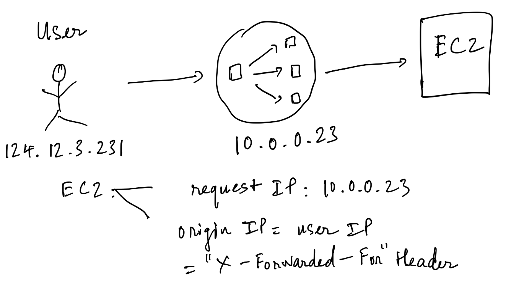
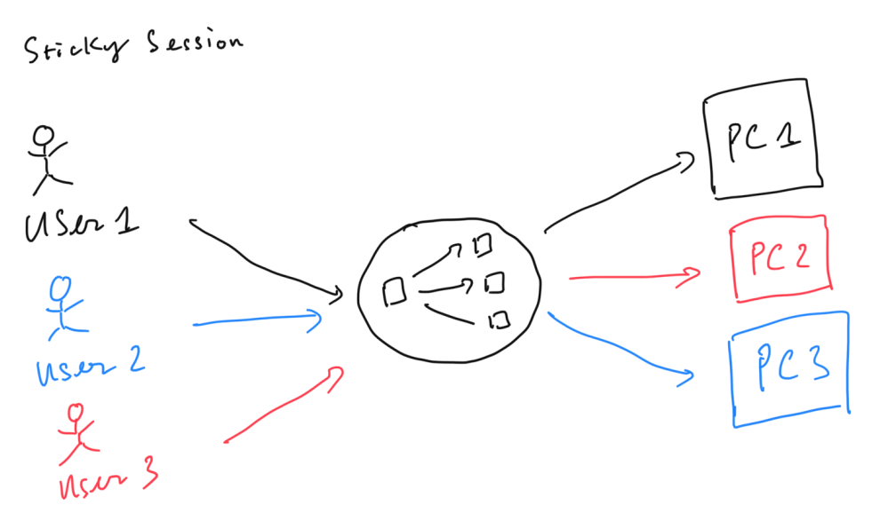
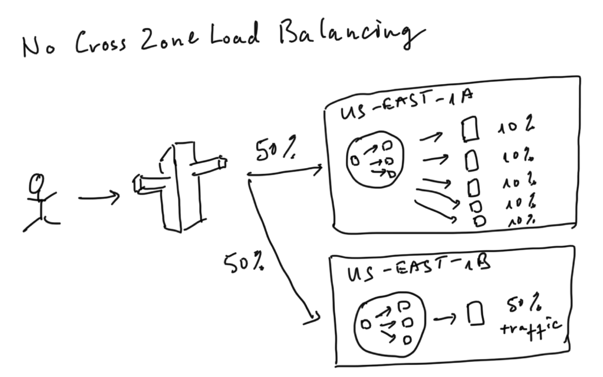
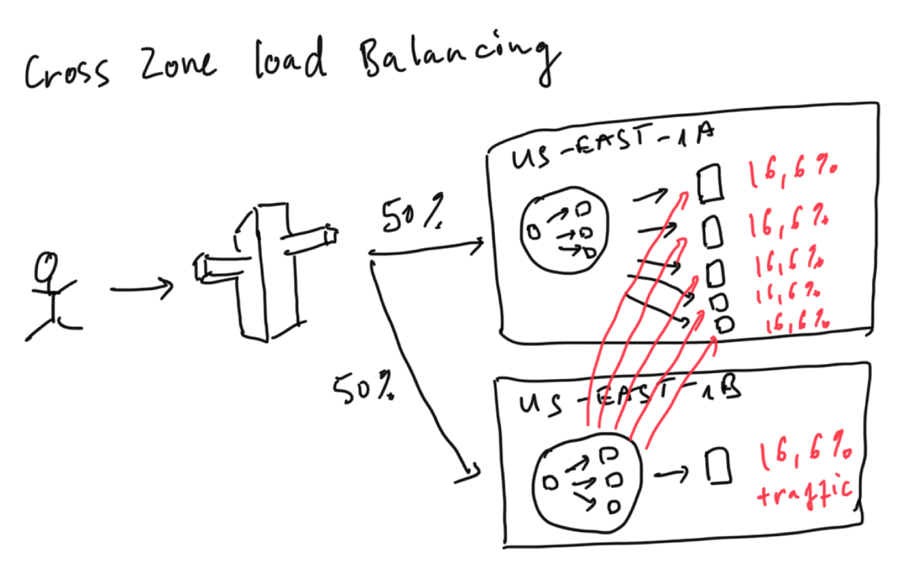
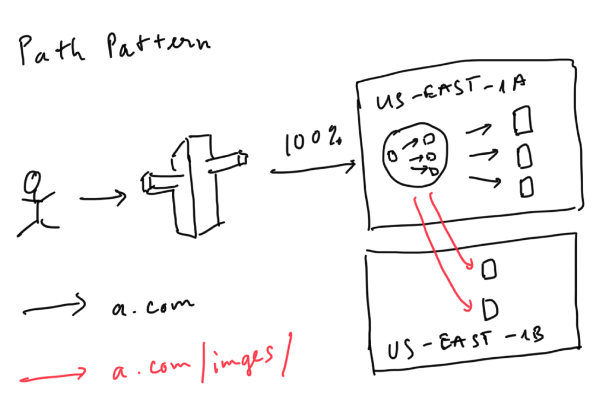

# HA Architecture

## Load Balancers

### Load Balancer types

- **Application Load Balancers** - best suited for load balancing of HTTP and HTTPS traffic, operate at *Layer 7* and **are *application-aware*, intelligent, create advanced request routing, sending *specified requests to secific web servers*
- **Network Load Balancers** - best suited for load balancing of TCP traffic where extreme performance is required, operate at the *connection level, Layer 4,* can handling millions of requests per second, while maintaining ultra-low latencies
- **Classic Load Balancers** - legacy Elastic Load Balancers, can use for load balance HTTP/HTTPS applications and use *Layer 7 - specific features* (X-Forwarded, sticky session), can *strict Layer 4* load balancing for app that rely purely on the TCP protocol
    - error 504 - time out error ⇒ need to trouble shoot the application failed (web server or database server?)
    - X-Forwarded-For Header

    

    EC2 instance look to X-Forwarded-For header to know origin IP (User IP)

### Tips

- instances monitored by ELB are reported as: InService, Outof Service
- health check checks the instance health by talking to it
- Load balances have their own DNS name (not IP)

### Advanced Load Balancer Theory

- Sticky Sessions: enable your users to stick to the same EC2 instance. useful if you are storing information locally to that instance (cache...)

- Cross Zone Load Balancing: enable you to load balance across multiple availability zones

- Path patterns: allow you to direct traffic to different EC2 instances based on the URL contained in the request

